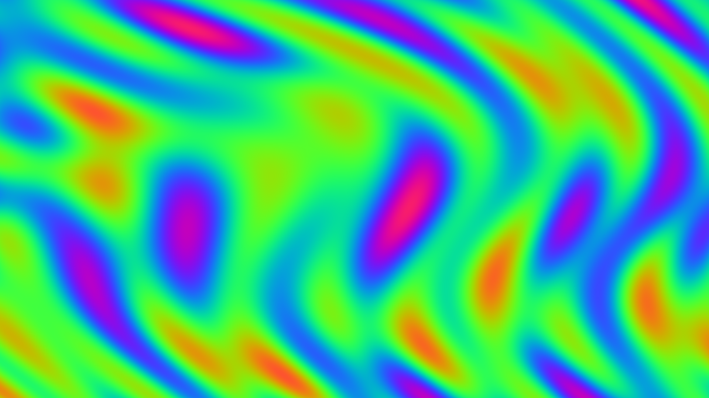
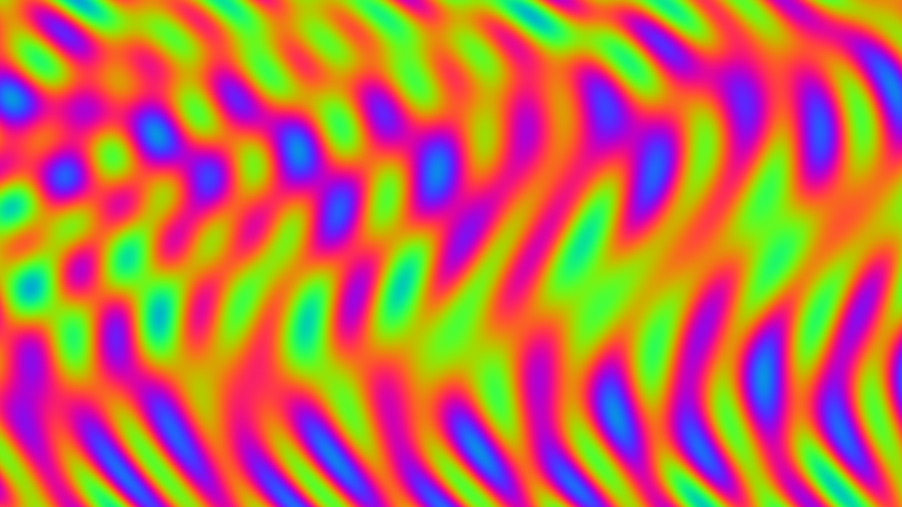
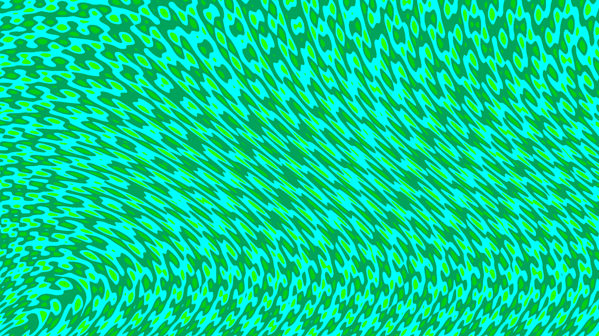
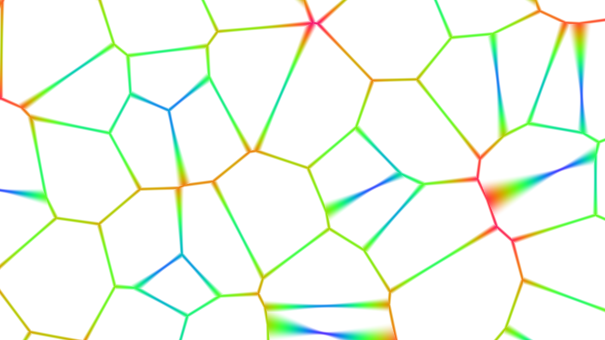

# PlasmaGL

A Windows screensaver that renders GPU-driven effects using OpenGL 3.3 Core shaders. Ships with four built-in visual effects and a live **Shader Editor** so you can write and preview your own GLSL fragment shaders without leaving the screensaver.

---

## Gallery

<p align="center">
  
  
</p>
<p align="center">
  
  
</p>

---

## Features

- **GPU-rendered effects** – the CPU only ticks a timer and pushes uniforms; all pixel work happens in GLSL
- **Ten built-in shaders** – Plasma, Ripple, Voronoi Cells, Fire, Wave Interference, Fractal Pyramid, Neon Fractal, Starfield, Fractal Galaxy, and Polka Dot
- **User shader library** – write custom fragment shaders, save them as named presets, and select them at runtime
- **Live Shader Editor** – split-pane editor with a real-time GLControl preview; auto-compiles after a 1.5-second debounce, or on-demand with the Compile button
- **Screenshots** – press F12 at any time to save a render to `Pictures\PlasmaGL` without interrupting the screensaver
- **11 colour palettes** – selectable from the Settings dialog (applies to the built-in Plasma shader)
- **Multi-monitor** – spawns a full-screen window per display
- **60-second seed rotation** – quietly randomises plasma parameters every minute for variety

---

## Tech Stack

| Layer | Technology |
|---|---|
| Language | VB.NET (Visual Studio, `.vbproj`) |
| Target framework | .NET Framework 4.8 |
| UI host | Windows Forms (`System.Windows.Forms`) |
| OpenGL | OpenTK 3.3.3 + OpenTK.GLControl 3.3.3 (NuGet `packages.config`) |
| Shader language | GLSL 3.30 Core |
| Settings storage | Windows Registry (`HKCU\Software\PlasmaGL`) |
| User shader storage | `%APPDATA%\PlasmaGL\shaders\` (`.frag` files) |
| Build system | MSBuild / Visual Studio 2019+ |

---

## Project Structure

```
PlasmaGL/
├── PlasmaGL.sln
├── packages/                       ← NuGet restored packages (not in git)
└── PlasmaGL/
    ├── Program.vb                  ← Entry point; routes /s /c /p switches
    ├── PlasmaForm.vb               ← Full-screen GL window; render loop
    ├── PlasmaPreview.vb            ← GLControl subclass for Display-Properties preview
    ├── SettingsForm.vb             ← Modal settings dialog (speed, palette, shader)
    ├── ShaderLibrary.vb            ← Shader catalogue; built-in sources + user-file I/O
    ├── ShaderEditorForm.vb         ← Live GLSL editor with split-pane GL preview
    ├── PlasmaGL.vbproj
    ├── packages.config             ← NuGet package list
    ├── App.config
    ├── OpenTK.dll.config           ← OpenTK platform/driver config (do not delete)
    └── My Project/                 ← Auto-generated VB.NET project metadata
```

---

## Screensaver Command-Line Protocol

Windows passes one of three switches when launching a `.scr` file:

| Switch | Meaning | What PlasmaGL does |
|---|---|---|
| `/s` | Run the screensaver | Opens a `PlasmaForm` per monitor; starts 60-second seed rotation |
| `/c` | Show configuration | Opens `SettingsForm` as a modal dialog |
| `/p <hwnd>` | Show preview pane | Embeds `PlasmaPreview` into the Display Properties preview HWND |
| *(none)* | Debug / F5 | Falls through to the settings dialog |

The compiled `.exe` must be **renamed to `.scr`** and placed in `C:\Windows\System32` to be recognised by Windows as a screensaver.

---

## Shader Library

### Built-in Shaders

All built-in shaders accept the same uniform set (see [Writing a Custom Shader](#writing-a-custom-shader) below).

| Name | Description |
|---|---|
| **Plasma (default)** | Classic 4-term sine plasma with sinusoidal lens warp and 8 selectable colour palettes |
| **Ripple** | Concentric rings expanding from centre with angular wobble driven by `seed1`/`seed2` |
| **Voronoi Cells** | Animated Voronoi diagram with white cell borders and cosine colour mapping |
| **Fire** | Upward-rising fractal Brownian motion (5-octave fBm) mapped to a black→red→orange→yellow→white flame gradient |
| **Wave Interference** | Full-screen multi-wave interference pattern with dynamic zoom powered by seed uniforms |
| **Fractal Pyramid** | Raymarched 3D fractal structure that rotates and morphs over time |
| **Neon Fractal** | Psychedelic glowing rings that iterate fractally from the center |
| **Starfield** | Volumetric star field with dynamic nebula-like formations and smooth vignette |
| **Fractal Galaxy** | Parallax scrolling fractal galaxy with dynamic noise-driven coloration and stars |
| **Polka Dot** | Grid of glowing polka dots with randomized time-varying intensity and preset palette cycling |

### User Shaders

User shaders are stored as plain `.frag` files under:

```
%APPDATA%\PlasmaGL\shaders\
```

They appear in the Settings dialog below the built-in shaders and are fully editable/deletable. Built-in shader names are reserved and cannot be overwritten.

---

## Shader Editor

Open the editor from **Settings → Edit / New Shader**.

- **Left pane** – `RichTextBox` GLSL code editor with monospace font and tab support
- **Right pane** – live `GLControl` preview running at ~60 FPS
- **Auto-compile** – triggers 1.5 seconds after the last keystroke
- **▶ Compile & Preview** – forces an immediate compile
- **Error strip** – compiler/linker errors appear in a red banner at the bottom
- **Save** – enabled only when the current source compiles cleanly; built-in names are rejected
- Editing a built-in shader automatically prompts for a new name (fork behaviour)

---

## Writing a Custom Shader

Your fragment shader must target **GLSL 3.30 Core** and declare `out vec4 fragColor`. The vertex shader is shared (full-screen clip-space quad) and cannot be edited.

All uniforms are optional — only declare the ones you use:

```glsl
#version 330 core
out vec4 fragColor;

uniform float iTime;       // monotonic animation clock (seconds)
uniform vec2  iResolution; // viewport size in pixels
uniform float seed1;       // random per-axis frequency multiplier (1–5)
uniform float seed2;       // random per-axis frequency multiplier (1–5)
uniform float scale;       // blob/pattern scale (2–60)
uniform float phase;       // same as iTime — drives colour cycling
uniform int   palette;     // user palette selection (0–10)

void main() {
    vec2 uv = gl_FragCoord.xy / iResolution.xy;
    vec3 col = vec3(uv, 0.5 + 0.5 * sin(iTime));
    fragColor = vec4(col, 1.0);
}
```

---

## Colour Palettes (Plasma shader)

Selectable via the Settings dialog. The `palette` uniform is passed to every shader but only the built-in Plasma shader branches on it.

| Index | Name | Description |
|---|---|---|
| 0 | RGB Cycle (Acid) | Full RGB cosine cycle with `vec3(0, 2.1, 4.2)` offset |
| 1 | Green | Single cosine on green channel |
| 2 | Red | Single cosine on red channel |
| 3 | Blue | Handled by the `else` branch (implicit) |
| 4 | Yellow-Orange-Red | Warm cosine blend, gamma-squared |
| 5 | Cool Vivid | 4-keyframe interpolation: cyan → green → blue → violet |
| 6 | Sunset | 5-colour weighted cosine blend: indigo/purple/magenta/orange/gold |
| 7 | Tropical | 4-segment hard colours: cyan/teal/lime/yellow-green |
| 8 | Cyberpunk | Linear mix from cyan-blue to magenta |
| 9 | Neon Ice | Cosine cycle with `vec3(0.263, 0.416, 0.557)` offset |
| 10 | Galaxy | Custom nonlinear mapping `vec3(p^3, p^2, p)` for deep cosmic colors |

---

## Settings & Registry Keys

All settings live under `HKCU\Software\PlasmaGL`:

| Value | Type | Default | Meaning |
|---|---|---|---|
| `Speed` | DWORD | 16 | Timer interval in ms (lower = faster; 10–200 range in UI) |
| `Palette` | DWORD | 0 | Active palette index (0–7) |
| `Shader` | String | `"Plasma (default)"` | Name of the active shader |

---

## Build & Run

### Prerequisites

- Visual Studio 2019 or later (Community edition is fine)
- .NET Framework 4.8 (pre-installed on Windows 10/11)
- NuGet package restore (automatic on first build)

### Steps

1. Open `PlasmaGL.sln` in Visual Studio.
2. Right-click the solution → **Restore NuGet Packages** (if not done automatically).
3. **Debug (F5)** – no arguments → falls through to the Settings dialog.
4. **Test as screensaver** – go to *Project → Properties → Debug → Command line arguments* and enter `/s`.
5. **Release build** – *Build → Build Solution* in Release configuration.

### Deployment

```
copy PlasmaGL\bin\Release\PlasmaGL.exe C:\Windows\System32\PlasmaGL.scr
```

Then right-click the desktop → **Personalize → Screen saver** and select **PlasmaGL**.

---

## License

See [LICENSE](LICENSE).
